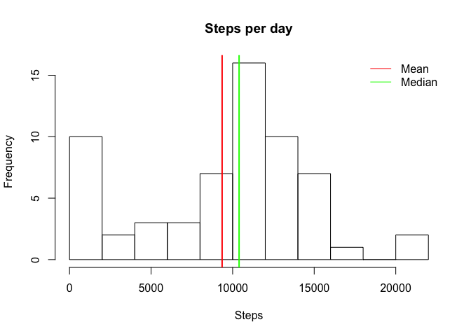

# Reproducible Research: Peer Assessment 1

### Authors notice: 
All numbers presented in this report are generated with R code, some of which is *inlined*. This means that anyone inspecting the rmd file will be able to see how the  values are computed, but the code will not be explicitely shown in the report. This has been done only for reporting values, calculating means/medians, etc., where the code for obtaining these data *is* shown. As such, there is no loss of information and the result is (arguably) a more readable report.

## Loading and preprocessing the data
The zip file containing the raw data is present in the repository by default. If the 
unzipped file is not, unzip it before loading the data. Note that the dates are 
explicitely converted to date format.

```r
if (!file.exists("activity.csv")){
    unzip("activity.zip", exdir = ".")
}

stepData <- read.csv("activity.csv", sep=",", header=TRUE)
stepData$date <- as.Date(as.character(stepData$date))
```

## What is mean total number of steps taken per day?
Start by calculating the total number of steps per day (ignoring missing values) 
and creating a histogram. To make it more clear what these numbers really mean, 
we add the mean and median to the histogram.

```r
stepsPerDay <- tapply(stepData$steps, format(stepData$date, '%Y-%m-%d'), sum, na.rm=TRUE) 
hist(stepsPerDay, main="Steps per day", xlab="Steps", breaks=10)
abline(v=mean(stepsPerDay), col="red", lwd=2)
abline(v=median(stepsPerDay), col="green", lwd=2)
legend("topright", legend=c("Mean", "Median"), lty=c(1,1), col=c("red", "green"), bty="n")
```

 

The mean number of steps per day is 9354.2295082, while the median is 
10395.

## What is the average daily activity pattern?
Start by finding the the average number of steps per 5 minute intervall averaged 
over all the days in the dataset. This is done by grouping rows by the interval 
number of any single day, and then averaging over those groups. We then use this 
vector of values in the plot, and locate the interval containing the maximum 
average number of steps.

```r
averageStepsPerInterval <- tapply(stepData$steps, stepData$interval, mean, na.rm=TRUE)
maxStepsInterval <- which.max(averageStepsPerInterval)
plot(unique(stepData$interval),
     averageStepsPerInterval, 
     type="l",
     main="Daily activity pattern",
     ylab="Average number of steps", 
     xlab="Interval")
```

 

The 104th intervall (minutes 835-840) is the one with the maximum average number of steps.

## Imputing missing values
Start by finding the number of rows containing NA:

```r
rowsWithNA <- nrow(stepData) - sum(complete.cases(stepData))
```

rowsWithNa=2304. Continue by inserting average value for that interval 
for NA values. Finally, create a new dataset using these new inserted values.


```r
newSteps <- ifelse(is.na(stepData$steps), 
                         averageStepsPerInterval[(stepData$interval)/5+1],
                         stepData$steps)

newStepData <- data.frame(newSteps, stepData$date, stepData$interval)
names(newStepData) <- c("steps", "date", "interval")
```

Next, we create the same histogram for the new data:

```r
newStepsPerDay <- tapply(newStepData$steps, format(newStepData$date, '%Y-%m-%d'), sum, na.rm=TRUE) 
hist(newStepsPerDay, main="Steps per day", xlab="Steps", breaks=10)
abline(v=mean(newStepsPerDay), col="red", lwd=2)
abline(v=median(newStepsPerDay), col="green", lwd=2)
legend("topright", legend=c("Mean", "Median"), lty=c(1,1), col=c("red", "green"), bty="n")
```

 

The mean number of steps per day in the new data is 1.0282143\times 10^{4}, while the median is 1.0395\times 10^{4}. These are closer to each other (difference of 112.8570987) than for the original data where NAs were ignored (difference of 1040.7704918). 

It is also noteworthy that the frequency of observations with very few steps has been reduced, which have resulted in the mean number of steps being shifted upward. 

## Are there differences in activity patterns between weekdays and weekends?

Start by adding a separating factor variable explaining whether each observation was made on a weekday or in a weekend.

```r
newStepData$dayclass <- factor(ifelse(weekdays(newStepData$date) == "Sunday" | weekdays(newStepData$date) == "Saturday", "weekend", "weekday"))
```

The panel plot differentiating these two is created next:

```r
par(mfrow=c(2,1))

weekdayObservations <- subset(newStepData, newStepData$dayclass == "weekday")
weekendObservations <- subset(newStepData, newStepData$dayclass == "weekend")

averageStepsPerIntervalWeekday <- tapply(weekdayObservations$steps, weekdayObservations$interval, mean, na.rm=TRUE)
averageStepsPerIntervalWeekend <- tapply(weekendObservations$steps, weekendObservations$interval, mean, na.rm=TRUE)

#maxStepsInterval <- which.max(averageStepsPerInterval)
plot(unique(stepData$interval),
     averageStepsPerIntervalWeekend, 
     type="l",
     main="Weekend Daily activity pattern",
     ylab="Average number of steps", 
     xlab="Interval",
     ylim=c(0,200))
plot(unique(stepData$interval),
     averageStepsPerIntervalWeekday, 
     type="l",
     main="Weekday Daily activity pattern",
     ylab="Average number of steps", 
     xlab="Interval",
     ylim=c(0,200))
```

 
